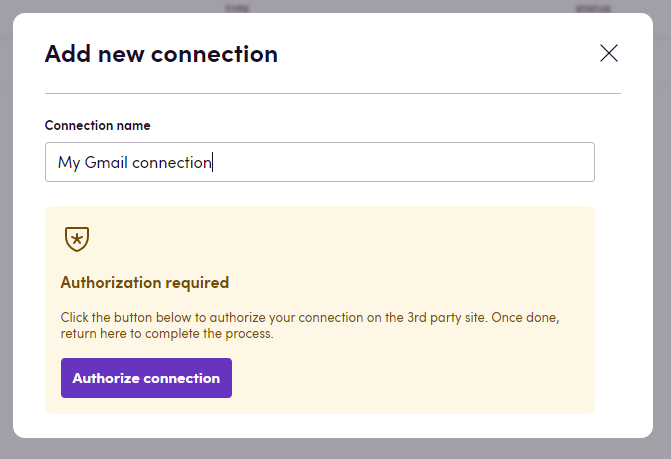

# Blackbird.io Gmail

Blackbird is the new automation backbone for the language technology industry. Blackbird provides enterprise-scale automation and orchestration with a simple no-code/low-code platform. Blackbird enables ambitious organizations to identify, vet and automate as many processes as possible. Not just localization workflows, but any business and IT process. This repository represents an application that is deployable on Blackbird and usable inside the workflow editor.

## Introduction

<!-- begin docs -->

Gmail is the email service provided by Google. Gmail offers a suite of tools and functions which make it easy to create a system that will keep your inbox organized, save you time, and free you up to focus on important business tasks.

## Before setting up

Before you can connect you need to make sure that:

- You have a **Gmail** account and you have the credentials to access it.

## Connecting

1. Navigate to Apps, and identify the **Gmail** app. You can use search to find it.
2. Click _Add Connection_.
3. Name your connection for future reference e.g. 'My Gmail connection'.
4. Click _Authorize connection_.
5. Establish the Gmail connection via OAuth.

## Actions

- **Search emails** Returns a list of IDs which can be used in conjunction with 'Get email'. Add an optional query to narrow your search. Supports the same query format as the Gmail search box. For example, "from:someuser@example.com rfc822msgid:<somemsgid@example.com> is:unread".
- **Get email** Returns email metadata, message and all attachments.
- **Send email** Sends an email, including attachments

## Events

- **On emails received** Triggered when new emails are received. You can optionally set a query to refine the search. The same query logic as 'Search emails' is used.

## Feedback

Do you want to use this app or do you have feedback on our implementation? Reach out to us using the [established channels](https://www.blackbird.io/) or create an issue.

<!-- end docs -->
